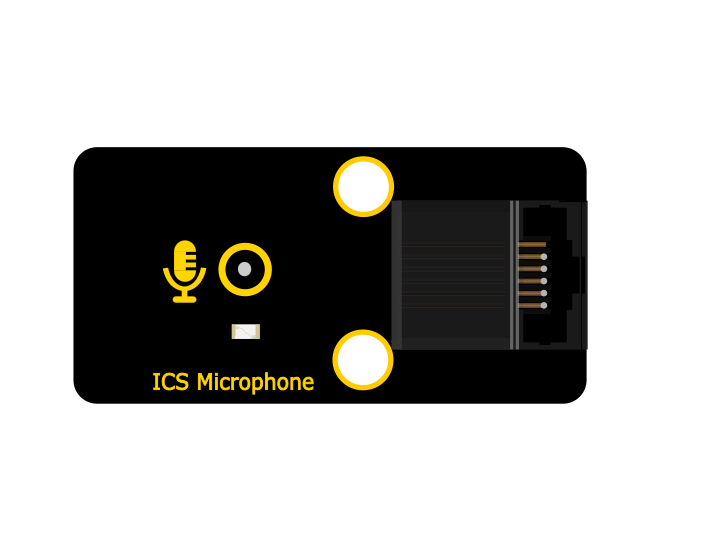
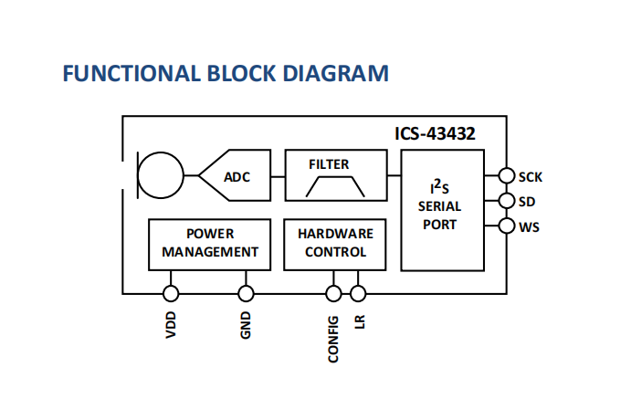
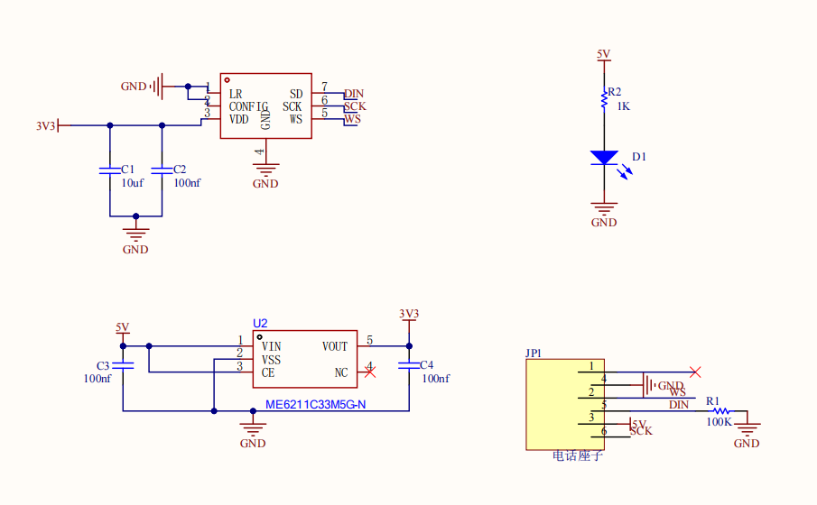
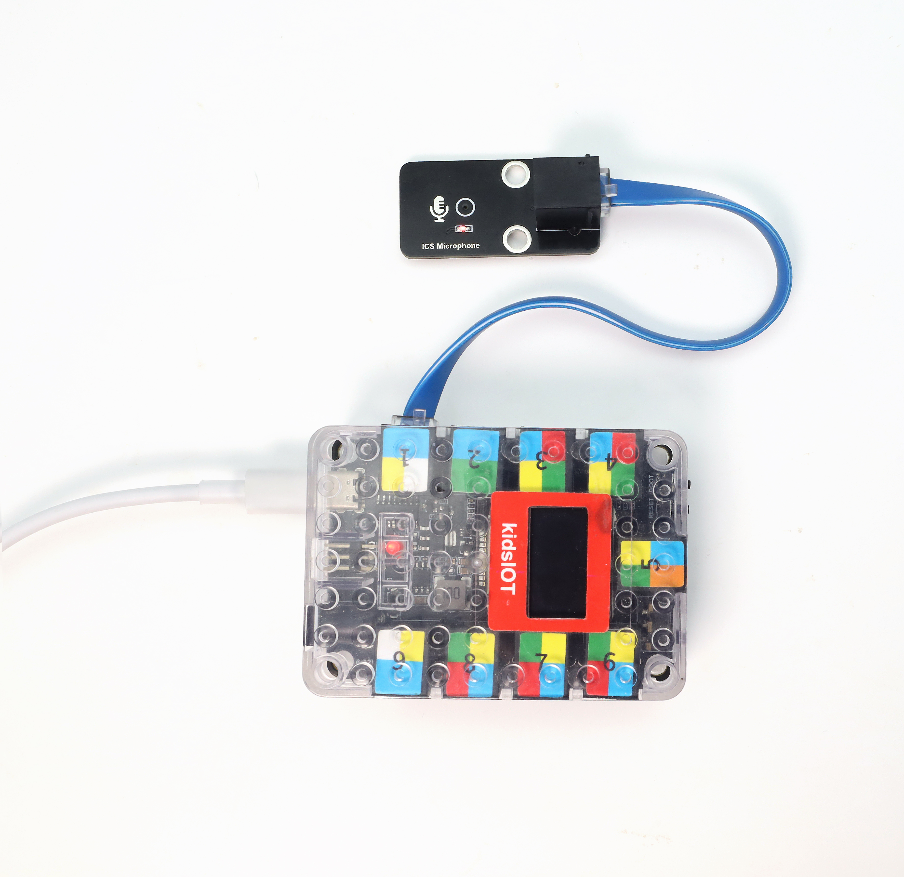
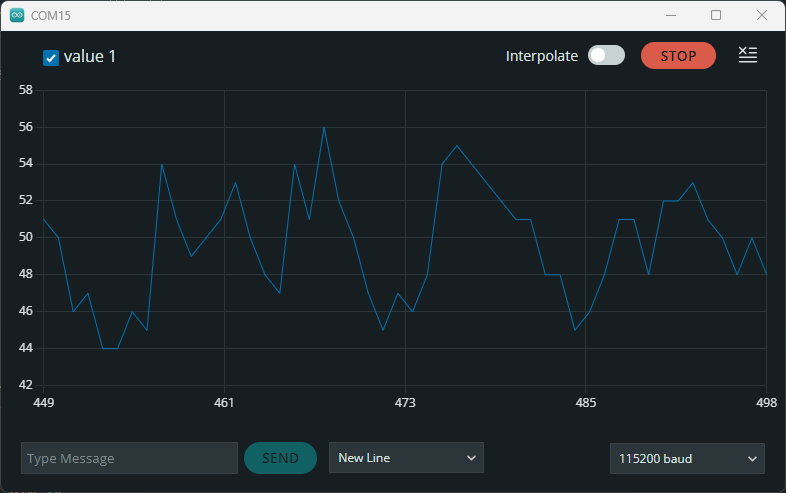
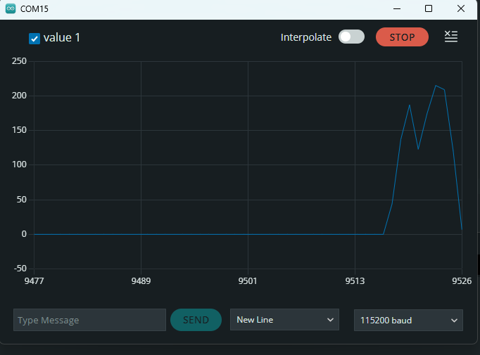
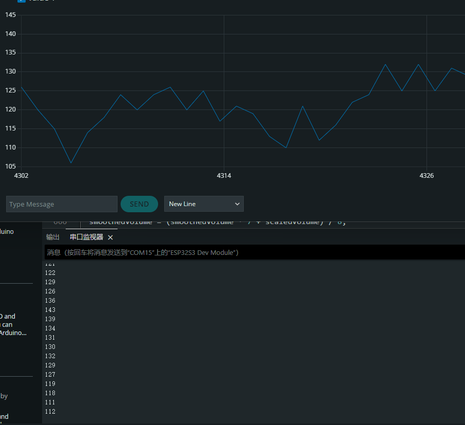

# KD2129 Kidsbits STEM Electronic Brick ICS Microphone Module



## 1. Introduction

This module mainly adopts an ICS-43432 digital microphone chip, which is a high-performance and low-noise MEMS microphone with a bottom microphone hole. It is equipped with an internal MEMS sensor, Σ-Δ ADC, anti-aliasing filter, power manager and interfaces conforming to the I2S standard, and it can directly output 24-bit digital audio signals.

Besides, it is compatible with various MCU control boards, including Arduino series, ESP32, Raspberry PI Pico, etc. Meanwhile, two positioning holes are reserved on it with a diameter of 4.8mm, which is convenient for fixing it on other devices.

## 2. Parameters

- **Operating voltage** : 1.6V - 3.3V DC
- **Interface** : I2S digital interface
- **Signal-to-noise ratio** : 65 dBA
- **Sensitivity** : -26 dBFS
- **Power consumption** : 1.5mA
- **Directivity** : Omnidirectional
- **Data format** : 24-bit I2S
- **Sensitivity tolerance** : ±1 dB
- **Acoustic overload point** : 116 dB SPL
- **Frequency response** : 50 HZ - 20 kHZ
- **Operating temperature** : -40°C to +85°C
- **Dimensions** : 48mm × 24mm × 1.6mm


## 3. Working Principle

**Chip features:**

- High-precision 24-bit digital I2S interface
- A sensitivity tolerance of -± 1 dB, suitable for microphone array applications
- Broadband response, covering both voice and audio ranges
- Low-power consumption, suitable for portable devices

**I2S interface timing:**

The I2S bus consists of three main signals:

- **SCK**: bit clock
- **WS**: word selection
- **DIN**: serial audio data

**Function diagram:**



**Schematic diagram**：



## 4. Pin Description

- **GND**: power ground
- **VDD**: power positive (+3.3V)
- **SCK**: bit clock input
- **DIN**: data output
- **WS**: Left and right channel clocks

## 5. Wiring

**Here we take ESP32-D0WDQ6 development board as an example:**

| Component                                                  | Quantity |
| ---------------------------------------------------------- | -------- |
| ESP32-D0WDQ6                                               | 1        |
| ICS-43432 microphone module                                | 1        |
| Left button 6P6C registered jack 6-core flat PET soft wire | 1        |
| TypeC cable                                                | 1        |


| Microphone module | ESP32 development board |
| ----------------- | ----------------------- |
| VDD               | 3.3V                    |
| GND               | GND                     |
| SCK               | GPIO14                  |
| WS                | GPIO12                  |
| DIN               | GPIO13                  |





## 6. Environment and Code

**Environment Construction**

For details, please refer to [KidsIOT STEM Education Development Board](https://wiki.kidsbits.cc/projects/KD2076/en/latest/docs/kidsIOT.html).

**Test Code**

Arduino IDE code(based on ESP32):


```cpp
#include "driver/i2s.h"
#include <Arduino.h>

long avgVol = 0;  

void setup() {
  Serial.begin(115200);
  
  // I2S configuration
  i2s_config_t config = {
    .mode = (i2s_mode_t)(I2S_MODE_MASTER | I2S_MODE_RX),
    .sample_rate = 44100,
    .bits_per_sample = I2S_BITS_PER_SAMPLE_32BIT,
    .channel_format = I2S_CHANNEL_FMT_ONLY_LEFT,
    .communication_format = I2S_COMM_FORMAT_STAND_I2S,
    .intr_alloc_flags = 0,
    .dma_buf_count = 4,
    .dma_buf_len = 64,
    .use_apll = false
  };

  i2s_pin_config_t pins = {
    .bck_io_num = 14,
    .ws_io_num = 12,
    .data_out_num = I2S_PIN_NO_CHANGE,
    .data_in_num = 13
  };

  i2s_driver_install(I2S_NUM_0, &config, 0, NULL);
  i2s_set_pin(I2S_NUM_0, &pins);
  i2s_start(I2S_NUM_0);
}

void loop() {
  int32_t samples[64];
  size_t bytes_read;
  
  i2s_read(I2S_NUM_0, samples, sizeof(samples), &bytes_read, portMAX_DELAY);
  
  long total = 0;
  for(int i = 0; i < 64; i++) {
    total += abs(samples[i]);
  }
  
  int raw = total / 64;  
  int scaled = raw / 30000;  
  avgVol = (avgVol * 9 + scaled) / 10;  
  int vol = constrain(avgVol, 0, 1000);  
  Serial.println(vol);  
   
  delay(200); 
}

```


## 7. Test Result

After burning the test code, wire up and power on, and turn on the serial monitor.

Normally receive external sounds:



Blow on the module:



Make some noise:




